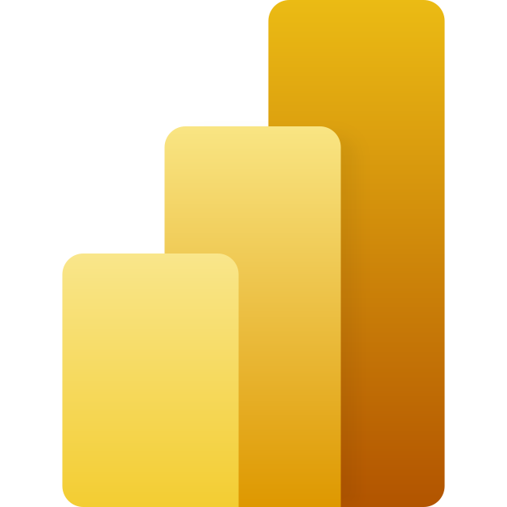

<div align="center">
  

  

**Full Stack Developer | React | Next.js | TypeScript | Node.js | JavaScript | Python | SQL | Power BI | Excel | n8n | Claude Code | AI-Assisted Development | Data Analytics & IA.**


  [](https://www.linkedin.com/in/edilson-moraes-047128408/)
  [](mailto:contato@developeredilsonebenezer.com.br)
  [](https://porfifolio-theta.vercel.app)
  [](https://edilson-5762.github.i0cartaodigital.developeredilsonebenezer.com.br/)
</div>

```
┌─ PAINEL ────────────────────────────────────────────────
│ FORMAÇÃO   Análise e Desenvolvimento de Sistemas
│ ATUAÇÃO    Full Stack Dev · Data Analyst em formação
│ STACK      Python · JS · React · Node · SQL
│ FOCO       Power BI · Excel · N8N · PyAutoGUI · Claude AI
└───────────────────────────────────────────────────────────
```

## Sobre mim

Desenvolvedor Full Stack graduado em **Análise e Desenvolvimento de Sistemas**, cursando pós-graduação em **Data Analytics & IA**. Construo aplicações web do front ao back e transformo dados em decisão — dashboards, automações e modelos preditivos. Interesse constante em unir desenvolvimento de software, análise de dados e inteligência artificial em soluções que resolvem problemas reais.

## Stack

**Linguagens & Front-end**

<table cellpadding="10" cellspacing="0" border="0"><tr>
<td align="center"><a href="https://www.python.org" target="_blank"></a><br/>Python</td>
<td align="center"><a href="https://developer.mozilla.org/docs/Web/JavaScript" target="_blank"></a><br/>JavaScript</td>
<td align="center"><a href="https://www.typescriptlang.org" target="_blank"></a><br/>TypeScript</td>
<td align="center"><a href="https://react.dev" target="_blank"></a><br/>React</td>
<td align="center"><a href="https://nextjs.org" target="_blank"><picture><source media="(prefers-color-scheme: dark)" srcset="https://cdn.simpleicons.org/nextdotjs/ffffff"/></picture></a><br/>Next.js</td>
<td align="center"><a href="https://nodejs.org" target="_blank"></a><br/>Node.js</td>
<td align="center"><a href="https://developer.mozilla.org/docs/Web/HTML" target="_blank"></a><br/>HTML5</td>
<td align="center"><a href="https://developer.mozilla.org/docs/Web/CSS" target="_blank"></a><br/>CSS3</td>
<td align="center"><a href="https://tailwindcss.com" target="_blank"></a><br/>Tailwind</td>
<td align="center"><a href="https://www.sqlite.org" target="_blank"></a><br/>SQL</td>
</tr></table>

**Dados & BI**

<table cellpadding="10" cellspacing="0" border="0"><tr>
<td align="center"><a href="https://powerbi.microsoft.com" target="_blank"></a><br/>Power BI</td>
<td align="center"><a href="https://www.microsoft.com/microsoft-365/excel" target="_blank"></a><br/>Excel</td>
</tr></table>

**Automação & IA**

<table cellpadding="10" cellspacing="0" border="0"><tr>
<td align="center"><a href="https://n8n.io" target="_blank"></a><br/>n8n</td>
<td align="center"><a href="https://pyautogui.readthedocs.io" target="_blank"></a><br/>PyAutoGUI</td>
<td align="center"><a href="https://www.anthropic.com/claude" target="_blank"></a><br/>Claude AI</td>
<td align="center"><a href="https://claude.com/product/claude-code" target="_blank"></a><br/>Claude Code</td>
<td align="center"><a href="https://git-scm.com" target="_blank"></a><br/>Git</td>
<td align="center"><a href="https://github.com/Edilson-5762" target="_blank"><picture><source media="(prefers-color-scheme: dark)" srcset="https://cdn.simpleicons.org/github/ffffff"/></picture></a><br/>GitHub</td>
</tr></table>

## Projetos

Todos os projetos com preview visual estão reunidos no **[Portfólio](https://porfifolio-theta.vercel.app)** — a lista abaixo é o índice organizado por área.

**Aplicações web**

| Projeto | Stack | Link |
|---|---|---|
| [iPhone 17 Pro](https://github.com/Edilson-5762/iphone-17) | React · Vite · Tailwind CSS | [demo](https://iphone-17-vert.vercel.app) |
| [Mercado Livre v2](https://github.com/Edilson-5762/mercado-livre-v2) | HTML · CSS · JavaScript | [demo](https://mercado-livre-v2.vercel.app) |
| [CineAchado](https://github.com/Edilson-5762/catalogo-filmes) | TypeScript | [demo](https://catalogo-filmes-tan.vercel.app) |
| [Conversor de Moedas](https://github.com/Edilson-5762/Conversor-de-Moedas) | HTML · CSS · JavaScript | [demo](https://conversor-de-moedas-seven-pi.vercel.app) |
| [Mario Bross](https://github.com/Edilson-5762/Projeto-Mario-Bross) | HTML · CSS · JavaScript | [demo](https://projeto-mario-bross-six.vercel.app) |

**Sites & landing pages**

| Projeto | Stack | Link |
|---|---|---|
| [Josilene Cuidadora](https://github.com/Edilson-5762/Josilene_Cuidadora) | HTML · CSS | [demo](https://josilene-cuidadora.vercel.app) |
| [Mary](https://github.com/Edilson-5762/MARY) | HTML · CSS · JavaScript | [demo](https://mary-one-taupe.vercel.app) |
| [Barbershop](https://github.com/Edilson-5762/BARBERSHOP) | HTML · CSS · JavaScript | [demo](https://barbershop-vert-beta.vercel.app) |
| [Currículo Online](https://github.com/Edilson-5762/Curriculo-Edilson-Moraes) | HTML · CSS | [demo](https://edilson-5762.github.io/Curriculo-Edilson-Moraes/) |

**Dados, BI & IA**

| Projeto | Stack | Link |
|---|---|---|
| [Customer Churn Analytics](https://github.com/Edilson-5762/customer-churn-analytics) | Python · IV · IQR | [repositório](https://github.com/Edilson-5762/customer-churn-analytics) |
| Dashboards Power BI → Web | Power BI · HTML · CSS | dentro do [Portfólio](https://porfifolio-theta.vercel.app) |

**Desktop**

| Projeto | Stack | Link |
|---|---|---|
| [Gerenciador de Estoque](https://github.com/Edilson-5762/CONTROLE-DE-ESTOQUE) | Python · CustomTkinter · SQLite | [repositório](https://github.com/Edilson-5762/CONTROLE-DE-ESTOQUE) |


📍 Brasília — DF, Brasil
